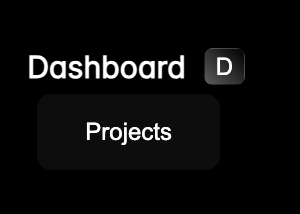
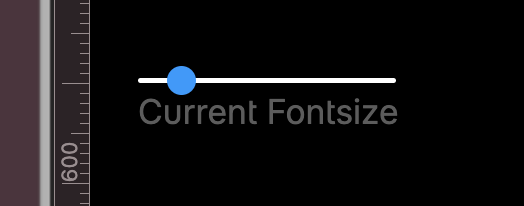
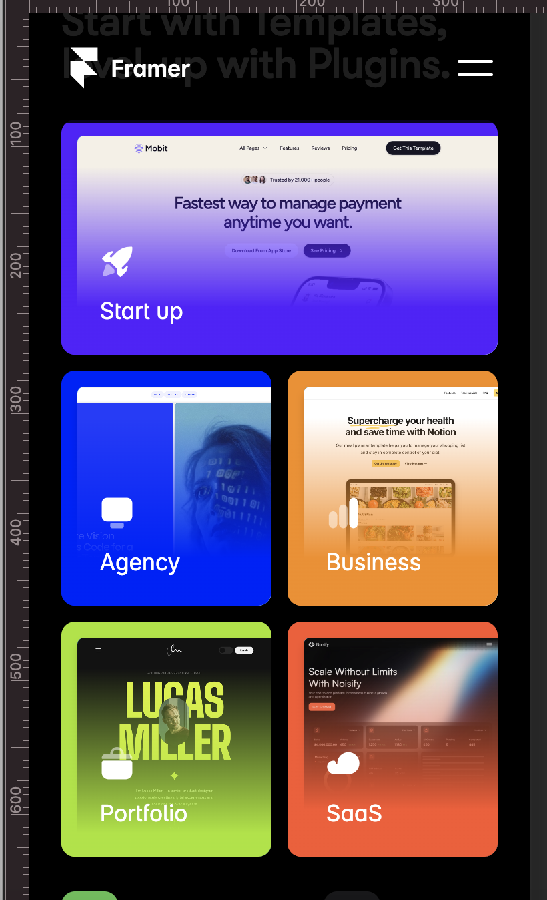
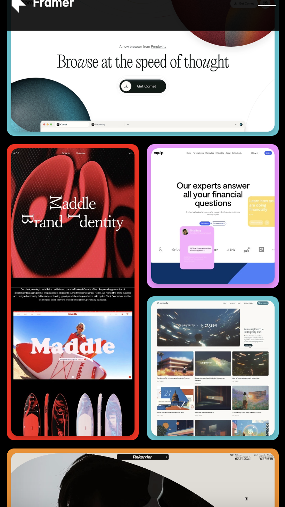
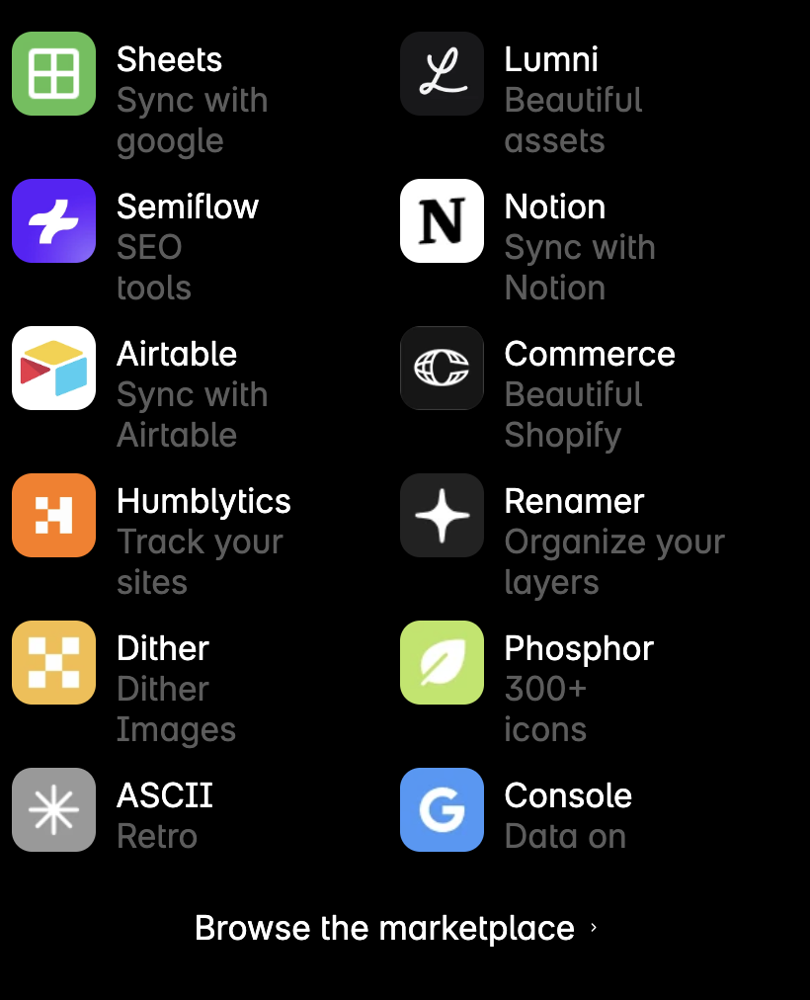
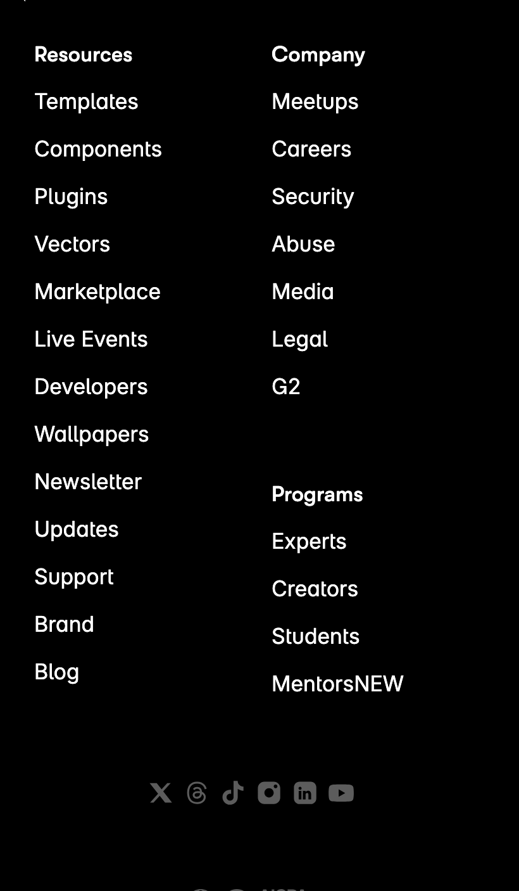
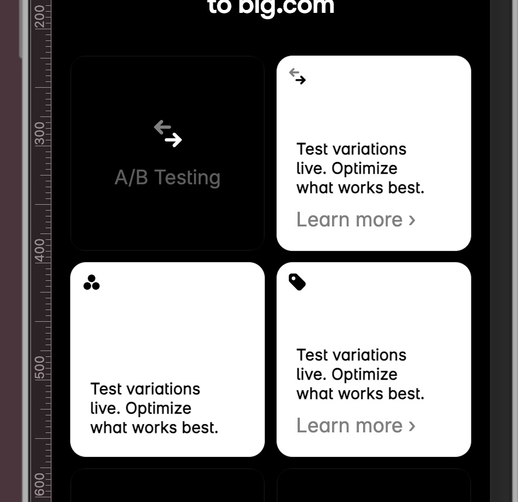
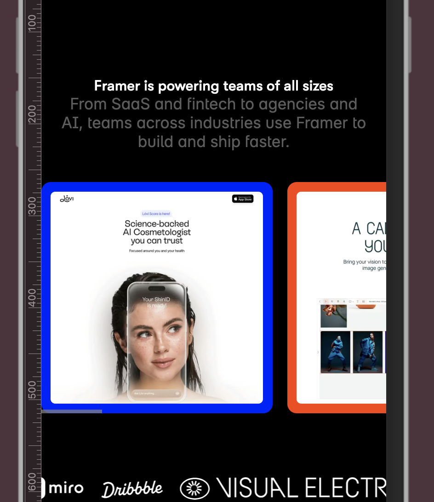
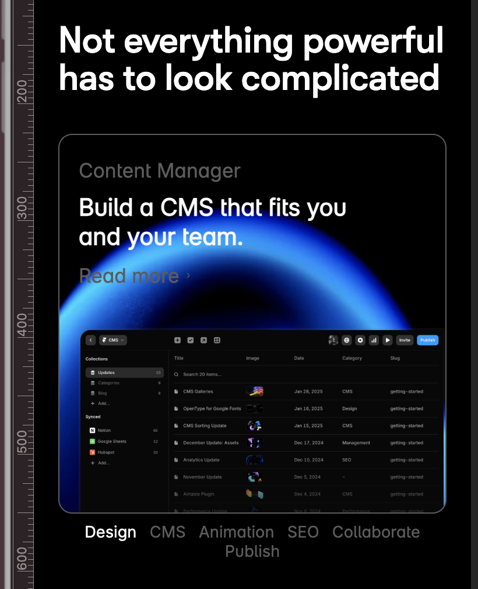

# Procesverslag FED


## Lisa Mandemakers

<details open>
  <summary>uitwerken voor kick-off werkgroep</summary>

  ### Auteur:
Lisa Mandemakers

  #### Je startniveau:
Rood

  #### Je focus:

Voor fed kies ik toch in eerste instantie surface plane, hier een lijst van dingen die ik overwoog om toe te passen en de gene met checkjes zijn daadwerklijk gebruikt in de site!
- Lettergrootte kunnen instellen ✅
- Prefers reduced motion
- Animaties toevoegen ✅
- Meerdere complete microinteracties ✅
- Svg icons stijlen en animeren ✅
- DOM Manipulatie  ✅
- Has() ✅
- Interactie met toetsenbord ✅
 
</details>


## Je website

<details>
  <summary>Website informatie</summary>

  ### Je opdracht:
  Ik heb gekozen voor de [Framer Website](https://www.framer.com/?via=quy-vu-manh&dub_id=lDEqkcLfbW2z5nyH&gad_source=1).

  #### Screenshot(s) van de eerste pagina (small screen): 
 [De home page](https://www.framer.com/?via=quy-vu-manh&dub_id=lDEqkcLfbW2z5nyH&gad_source=1)
 
  

  #### Screenshot(s) van de tweede pagina (small screen):
  De Enterprise page
  
  
 
</details>


## Toegankelijkheidstest 1/2 (week 1)

<details>
  <summary>uitwerken na test in 2<sup>e</sup> werkgroep</summary>

  ### Bevindingen

  #### Kansen voor verbetering Framer voor de screenreader:
* Hij ziet wel de links maar niet de images of logo’s 
* Je krijgt bij de text blokken met knoppen “learn more” alleen dat te horen, je weet dus helemaal niet waar dat naar verwijst
* Bij sommige links leest die de hele https request voor, dit kan best verwarrend zijn 
* Hij slaat een hele sectie over die met alleen teksten 
* Ze maken alleen maar gebruik van divs, classes, I D’s ipv gewone semantics zoals “main” “footer” “header”
* Sanne gaat letten op de structuur en de koppen en de alt teksten 

#### Wat wel goed is:
* Consistente opbouw met herbruikbare componenten: De site is duidelijk modulair opgebouwd, waardoor onderdelen visueel en technisch herkenbaar zijn. Dit helpt bij onderhoud en uitbreiding.

* Heldere hiërarchie van contentblokken: Hoewel er weinig semantische tags zijn, is de volgorde van de secties logisch en voorspelbaar. Dit geeft een zekere consistentie.

* Responsiviteit goed uitgewerkt: De site past zich netjes aan verschillende schermgroottes aan. Voor screenreaders is dit indirect gunstig, omdat content op mobiel niet ineens verdwijnt of verkeerd wordt ingeladen.
</details>


## Breakdownschets (week 1)

<details>
  <summary>uitwerken na afloop 3<sup>e</sup> werkgroep</summary>

  ### 1. De home pagina: 
  

  ### 2. De enterprise pagina: 
  
    
  <!-- ### dynamisch deel (bijv menu): 
  

  ### wellicht nog een dynamisch deel (bijv filter): 
   -->
</details>


## Voortgang 1 (week 2)

<details>
  <summary>uitwerken voor 1<sup>e</sup> voortgang</summary>

  ### Stand van zaken
Mijn Framer-website is sinds gisteren veranderd, wat een tegenvaller is, maar ik heb gelukkig nog wel screenshots die ik kan gebruiken. Hierdoor kan ik niet alles meer precies nachecken, maar ik wil alsnog bespreken hoe ik mijn code kan vereenvoudigen door minder te nesten en onnodige divs te vermijden, terwijl ik de HTML semantisch correct houd. Ook wil ik de aanpak van de slider op de homepage bekijken, mijn breakdownschets nagaan en controleren of ik divs en classes op de juiste manier heb gebruikt. Daarnaast wil ik de opzet van mijn CSS doornemen om te zorgen dat deze overzichtelijk en logisch is.

#### Werken met Grid
Deze week gingen we aan de slag met grid, wat ik zeker ook in mijn website ga toepassen, hier heb even een overzicht voor mezelf geschetst zodat ik weet wat voor grid layout ik moet maken:

  
  

  

  

  ### Agenda voor meeting
  samen met je groepje opstellen

  | Robin Yildiz   | Kaa Leung Ho         | Kaj-Benjamin Sitanala    | Lisa Mandemakers (ik)       |
  | ---            | ---                  | ---          | ---              |
  | Breakdownschets nakijken | Breakdownschets nakijken          | Breakdownschets nakijken    |  Ik wil minder gaan nesten en onnodige divs gbruiken, hoe pak ik dit aan   |
  | Html structuur controleren of het matcht met breakdownschets | Html structuur controleren of het matcht met breakdownschets | Html structuur controleren of het matcht met breakdownschets | Kijken of mijn Html semantisch correct is |  Hoe ga ik de slider op de homepage aanpakken?
  | Groenlicht krijgen voor css          | Groenlicht krijgen voor css               | Groenlicht krijgen voor css           | Breakdownschets nagaan          |
|| | een erg volle css | De divs / classes op sommige plekken, correct gebruikt of niet?| 
| | | | Css  opzet checken |


  ### Verslag van meeting
  hier na afloop snel de uitkomsten van de meeting vastleggen

  - Zorg dat de taal goed klopt
- Weten hoe je in javascript zonder id en classes kan selecteren ?
    - Je tikt letterlijk gewoon:  document.queryselector(“header nav button”)
- Hamburger menu mag in een button
- Link voor carrousel met css: https://chrome.dev/carousel-configurator/
    - Werk alleen in Chrome

- Ik moet nog letten op de volgorde van de heading
- Svg’s zijn goed om te gebruiken
    - En makkelijk stijlbaar 

- Webarchive.org om oude webversies te kunnen bekijken

- Je kunt met de screenreader alle html elementen checken, lanmarks: voor navigatie
- Ctrl opt U en met pijltjes links rechts en boven naar beneden om dingen te selecteren

- Je moet a links die telkens het zelfde zijn aanpassen door er onzichtare span zin te zetten en hier de verduidelijkte naam in


</details>


## Voortgang 2 (week 3)

<details>
  <summary>uitwerken voor 2<sup>e</sup> voortgang</summary>

  ### Stand van zaken
  hier dit ging goed & dit was lastig (neem ook screenshots op van delen van je website en code)

  


  ### Agenda voor meeting
  samen met je groepje opstellen

  | Robin Yildiz    | Kaa Leung Ho          | Kaj-Benjamin Sitanala     | Lisa Mandemakers (ik)        |
  | ---            | ---                | ---          | ---              |
  | HTML controleren  | De verbeterde html van de 1e webpagina nakijken             |  HTML controleren  | Hoe pak ik de grid layout aan want er zit een hele kleine schaduw in    |
  | CSS controleren | Flexbox in de eerste en tweede navigatie controleren | CSS controleren | Waarom werkt een scrollstate wel op `` en niet op `<li>`
  |             | Hero-section controleren                | ...          | Hoe kan ik mijn ticker, smooth maken           |  |
 | ...            | Hamburger menu: css of javascript                | ...          | ...               | 
 | ...            | Vraag bij uitklapbare dropdown menu :hover - hoe uitwerken in javascript?                | Eerste opzet html van de tweede webpagina controleren (met name webshop gedeelte)          | ...              |
 | ...            | ...                | ...          | ...              |
 | ...            | ...                | ...          | ...              |


  ### Verslag van meeting
  hier na afloop snel de uitkomsten van de meeting vastleggen

 - Minimum scherm breedte 375 aanhouden 
- Mag je margin gebruiken? Ja voor kleine dingen / spacings wel
- Mijn eigen vragen: hoe kan ik LI items aanspreken.
- Ik heb besproken met de studentassistent hoe ik de kaarten aan de zeikant wel een lagere opacity kan geven en beter kan maken
</details>


## Toegankelijkheidstest 2/2 (week 4)

<details>
  <summary>uitwerken na test in 9<sup>e</sup> werkgroep</summary>

### Dit waren de punten die verbeterd konden worden
- Hij skipt over de H1, H2, H3, H4 en bodyteksten 
- Hij ziet wel de links maar niet de images of logo’s 
- Je krijgt bij de text blokken met knoppen “learn more” alleen dat te horen, je weet dus helemaal niet waar dat naar verwijst
- Bij sommige links leest die de hele https request voor, dit kan best verwarrend zijn 
- Hij slaat een hele sectie over die met alleen teksten 
- Ze maken alleen maar gebruik van divs, classes, ID’s ipv gewone semantics zoals “main” “footer” “header”

### Dingen die ik heb verbererd in de nieuwe site
- Ik heb overal relevante alt teksten gebruikt, dus elke afbeelding wordt nu goed uitgelegd
```html
        <li data-label="Publish">
					<h3>Build a CMS that fits you and your team</h3>
					<p>Publishing</p>
					<a href="">Learn more<span class="hidden">about Publishing</span></a>
					
				</li>
```


- Ik heb de H1, H2, H3, H4 en bodyteksten goed en sematisch ingezet dus de screenreader heeft nu een stuk gestructureerde koppen schema’s
- Wanneer er een “learn more” button is, is is er voor de screenreader een span die dat voorleest zodat de gebruiker daadwerkelijk weerwaar het om gaat

```html
		<li data-label="Design">
					<h3>Build a CMS that fits you and your team.</h3>
					<p>Content Manager</p>
					<a href="#" class="link">
						Read more <span class="hidden">about how to buid a cms</span>
						<svg width="7px" height="10px" viewBox="0 0 24 24" fill="none"
							xmlns="http://www.w3.org/2000/svg" aria-hidden="true" focusable="false">
							<path d="M6 6 L12 12 L6 18" stroke="currentColor" stroke-width="2" stroke-linecap="round"
								stroke-linejoin="round" />
						</svg>
					</a>
					
				</li>
```


- Links die niet gelinkt zijn hebben een “#” en anders leest ie gewoon netjes de naam voor
```html
      <ul>
				<li><a href="#">Product</a></li>
				<li><a href="#">Teams</a></li>
				<li><a href="#">Resources</a></li>
				<li><a href="#">Support</a></li>
				<li><a href="#">Support</a></li>
				<li><a href="enterprise.html">Enterprise</a></li>
				<li><a href="#">Pricing</a></li>
				<li><a href="#">Dashboard </a><button>D</button></li>
				<li> <input type="range" min="12" max="52" value="15" step="5">
					<p>Current Fontsize</p>
				</li>
			</ul>
```


- Alle html tags zijn semantisch gebruikt, amper classes, ID’s en divs gebruikt.


</details>


## Voortgang 3 (week 4)

<details>
  <summary>uitwerken voor 3<sup>e</sup> voortgang</summary>

  ### Stand van zaken
  hier dit ging goed & dit was lastig (neem ook screenshots op van delen van je website en code)


  ### Agenda voor meeting
  samen met je groepje opstellen

  | Robin Yildiz     | Kaa Leung Ho         | Kaj-Benjamin Sitanala    | Lisa Mandemakers (ik)        |
  | ---            | ---                | ---          | ---              |
  | Check up  | CSS controle          | Overal checkup    |  Gaps zijn niet gelijk in grid, mag je in dit geval margins gebruiken? (Sectie 4)    |
  | Html checken |  |Spans juist gebruikt | dit wil ik zeker |
  | CSS           | Mag een a in een a              | Color scheme volgorde        |  Ik heb alleen een div om een afbeelding gezet die een mask layer heeft (Sectie 8)              |


  ### Verslag van meeting
  hier na afloop snel de uitkomsten van de meeting vastleggen

  
Andere mensen uit mijn groepje
- Wat moet er in een label? > een for attribute
- Waarom werkt de screenreader niet? > omdat hij die niet heeft gedownload
- Select custom una > website voor custom select 
- Bij de root  colors verander je de light and dark mode
    - Je stopt de root gewoon in de media (prefers-color-scheme: dark) direct onder de root


Uitkomsten
- Definieert grid-template-areas met text:
- Mask mag om een div heen, want kan helaas nog niet op images
- en je mag een `p` in een `li` doen maar alleen als nodig is.


</details>


## Eindgesprek (week 5)

<details>
  <summary>uitwerken voor eindgesprek</summary>

  ### Je uitkomst - karakteristiek screenshots:

  #### De Dashboard Button
  

  Deze knop is ook beschikbaar om op te klikken met het toetsenbord. dit maakt het nog toegankelijker en is een leuke toevoeging van de site, ik vond het best lastig om deze knop mooi en identiek na te maken maar het is uiteindelijk gelukt en ik ben blij met het resultaat dit is de stijling van de knop:

  ```css
  body header nav ul li>button {
  background-image: linear-gradient(45deg, var(--framer-text-color), var(--black));
  border-radius: 5px;
  color: var(--always-white-color);
  border: 1px solid var(--border-color);
  position: relative;
     cursor: pointer;
}
  ```

  #### Letter Grootte Slider
   

  Ik heb de website nog toegankelijker gemaakt door een letter slider toe te voegen.

  ```css
input[type="range"] {
  -webkit-appearance: none;
  height: 0.2em;
  background: var(--white);
  border-radius: 2px;
  outline: none;
}

/* chrome / safari */
input[type="range"]::-webkit-slider-thumb {
  -webkit-appearance: none;
  width: 1.1em;
  height: 1.1em;
  border-radius: 50%;
  background: var(--framer-link-text-color);
  cursor: pointer;
}

  ```


  ### Dit ging goed/Heb ik geleerd: 
  Korte omschrijving met plaatjes

  #### `display: grid`
  
  
  
  
  

  Ik gebruikte hiervoor eigenlijk zelden grid, maar tijdens dit vak heb ik het heel vaak moeten gebruiken. Eerst was ik een beetje sceptisch want ik gebruikte eigenlijk altijd `flexbox` in combinatie met veel divs. Maar na het een paar keer te gebruiken heb ik gemerkt dat het voor sommige dingen echt gunstiger is dan flexbox en het bespaard je een hoop divs en classes. Ik ben heel blij dat ik nu ook `display:grid` onder de knie heb, dat was een doel van mij. Ik heb ook de hele footer kunnen maken met grid.


  ```css
main>section:nth-of-type(4) {
  display: grid;
  grid-template-columns: 1fr 1fr;
  grid-template-rows: max-content 1fr max-content max-content 2em;
  gap: 0.2em;
  margin-top: 5em;

}

main>section:nth-of-type(4) h2 {
  grid-column: span 2;
  justify-self: center;
  text-align: center;
  padding-bottom: 1em;
}
  ```

#### `:has` 
  

  Ik had eerst deze info cards gemaakt, met een javascript functie en een button waarmee je interactie kon krijgen met de kaart. Maar voor die JS functies had ik classes nodig. Ik wist nog van de minor dat dit ook zonder classes kan en ik dit kon oplossen met `:has`. Het heeft me veel tijd gekost, maar ik ben er uiteindelijik uitgekomen. Ik heb de properties die variabel waren in een variabele gezet en wanneer de checkbox aangevinkt wordt veranderd deze variabele. Hiermee kon ik de hele kaart met css only animeren! Het enige waar ik JS nog voor heb gebruikt is voor de timer die op de kaarten zit, want na 20 sec gaat de kaart weer naar default modus.

  ```css
  li {
            position: relative;
            aspect-ratio: 1 / 1;
            overflow: hidden;
            border-radius: 0.8em;

            --card-position: translateY(110%);
            --h3-position: translate(0.7em);
            --card-opacity: 1;
            --h3-opacity: 0;
            --link-opacity: 0;
            --p-opacity: 1;
            --link-position: translateY(0.7em);
            --position-icon: translate(0);
            --scale-icon: 1;
            --svg-color: var(--white);
  }
  ```

```css

li:has(input:checked) article:nth-of-type(1) p {
    /* --card-opacity: 0; */
    --p-opacity: 0;
}

li:has(input:checked) article:nth-of-type(2) {
    --card-position: translateY(0);
}

li:has(input:checked) article:nth-of-type(2) h3 {
    --h3-position: translateY(0);
    --h3-opacity: 1;
}

li:has(input:checked) article:nth-of-type(2) a {
    --link-opacity: 1;
    --link-position: translateY(0);
}

li:has(input:checked) article:nth-of-type(1) svg {
    --position-icon: translate(-8em, -6em);
    --scale-icon: 0.6;
}

li:has(input:checked) article:nth-of-type(1) svg path {
    --svg-color: var(--black);
}

```


  ### Dit was lastig/Is niet gelukt:
  Korte omschrijving met plaatjes


  #### Automatic looping carousel
  

  Dit was de allermoeilijkste sectie van allemaal, ik had natuurlijk in de homepage ook al een carousel gemaakt met only css, maar deze moest ook nog eens automatisch worden , in een codepen ben ik bezig geweest en chatGPT heeft me een mooie JS functie gegeven diie iik kon toepassen op de carousel. In de codepen werkte alles uitstekend, maar toen ik hem in mijn eigen code wilde implementeren werkte het maar niet. Uiteindelijk ben ik rustig door alle code gegaan en ben ik er uit gekomen wat er mis was. 

  ```html
      <li data-label="Flower website">
            <a href="#">
                
            </a>
      </li>
```

  ```js
   const ul = document.querySelector('main > section:nth-of-type(6) ul');

/* autoscrollen */
setInterval(() => {
  const distance = ul.clientWidth;          // breedte 1 card
  const max = ul.scrollWidth - ul.clientWidth;

  if (ul.scrollLeft >= max - 5) {
    // terug naar begin
    ul.scrollTo({ left: 0, behavior: "smooth" });
  } else {
    // 1 card verder
    ul.scrollBy({ left: distance, behavior: "smooth" });
  }

}, 2500); // elke 2.5 sec

```


  #### Carousel
   

Ik heb de carousel slider van de oefeningen uit de les gebruikt, deze carousel was een beetje anders want ipv bolletjes had deze tekst, maar met een after of die elementen kon ik dat heel makkelijk aanpassen, omdat elk `li` item een eigen unieke `data-label` heeft.

  ```css
main>section:nth-of-type(3) li::scroll-marker {
  content: attr(data-label);
  font-family: "Inter-Variabele";
  border-radius: 1em;
  font-size: .8em;
  white-space: nowrap;
  transition: .25s;
  text-decoration: none;
  color: var(--framer-text-color);
}

  ```


    #### Forms

    ```html
    <form action="">
                <svg xmlns="http://www.w3.org/2000/svg" display="block" role="presentation" viewBox="0 0 20 20">
                    <path
                        d="M 0.642 16.241 C 0.262 16.353 -0.091 16 0.021 15.621 L 1.172 11.708 C 0.591 10.6 0.262 9.338 0.262 8 C 0.262 3.582 3.844 0 8.262 0 C 12.681 0 16.262 3.582 16.262 8 C 16.262 12.418 12.681 16 8.262 16 C 6.924 16 5.663 15.671 4.554 15.091 Z"
                        fill="var(--19qepfv, var(--token-26e3cb56-8447-4a64-9b7d-37f16a9909d4, rgb(255, 255, 255)))"
                        height="16.26231827687469px" id="YF58gxeKl" transform="translate(1.738 2)"
                        width="16.262318164110184px" />
                </svg>
                <fieldset>
                    <legend>Talk to sales</legend>
                    <p>Let's help your team build better.</p>
                    <label for="name">Name</label>
                    <input id="name" type="text" placeholder="First and last name">

                    <label for="email">Email</label>
                    <input id="email" type="email" placeholder="Work email">

                    <label for="company">Company</label>
                    <input id="company" type="text" placeholder="Company">

                    <label for="help">How can we help?</label>
                    <textarea name="help" id="help" placeholder="Tell us about your enterprise needs"></textarea>

                    <input type="submit" value="Get in touch" id="submit">
                </fieldset>
            </form>
    ```

</details>


## Bronnenlijst

<details open>
  <summary>continu bijhouden terwijl je werkt</summary>

  Nb. Wees specifiek ('css-tricks' als bron is bijv. niet specifiek genoeg). 
  Nb. ChatGpT en andere AI horen er ook bij.
  Nb. Vermeld de bronnen ook in je code.

  1. [Framer Website](https://www.framer.com/?via=quy-vu-manh&dub_id=lDEqkcLfbW2z5nyH&gad_source=1).
  2. [Carousel codepen - DLO](https://codepen.io/shooft/pen/QwjQGZe).
  3. [Nav Codepen - DLO](https://www.framer.com/?via=quy-vu-manh&dub_id=lDEqkcLfbW2z5nyH&gad_source=1).
  4. [Grid Codepen - Sanne](https://codepen.io/shooft/pen/jEWygoo).
  5. [Info cards Codepen - Chris Donker](https://www.framer.com/?via=quy-vu-manh&dub_id=lDEqkcLfbW2z5nyH&gad_source=1).
  6. [Ticker YT Tut](https://www.framer.com/?via=quy-vu-manh&dub_id=lDEqkcLfbW2z5nyH&gad_source=1).
  7. [Timer checkbox -ChatGPT ](ChatGPT).
  8. [Grid generator](https://cssgrid-generator.netlify.app/).
  9. [CSS nesting - MDN ](https://developer.mozilla.org/en-US/docs/Web/CSS/CSS_nesting).
  9. [:has  - css tricks](https://css-tricks.com/the-css-has-selector/).

</details>